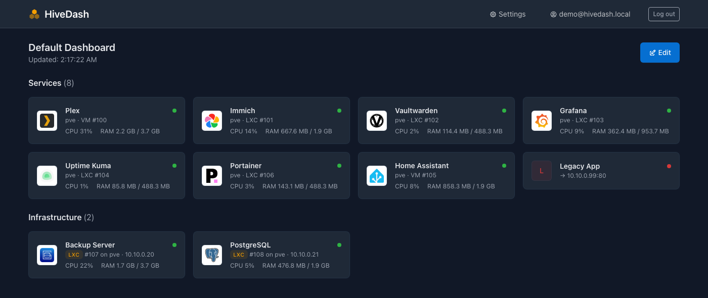

# HiveDash


A self-hosted, multi-user dashboard for your homelab that **auto-discovers** services -
no manual YAML per service, no keeping a config file in sync with what's actually running.



- **Nginx Proxy Manager**: every configured proxy host is fetched via its API and shown as
  a clickable tile, with domain and live online/offline status.
- **Proxmox VE**: every VM and LXC container is fetched via its API (name, status, CPU/RAM).
  Where possible, a Proxmox guest is automatically matched to its Nginx Proxy Manager host
  (by IP, or by hostname if the proxy points at a hostname instead of a raw IP) and shown as
  one combined tile with live stats. Anything that can't be matched is still shown - as a
  plain link (an unmatched proxy host) or a bare infrastructure tile (an unmatched guest) -
  nothing is ever silently dropped.

A new proxy host in NPM or a new VM/LXC in Proxmox just shows up automatically after the
next poll interval - nothing to configure per service.

Multi-user: every login sees the same auto-maintained default dashboard by default, but an
admin can create additional dashboards and curate per-dashboard visibility, order, category
and display name for each service - and assign individual users to one of them.

Every service also gets a logo automatically, as soon as a matching keyword is found in the
logo library (`/admin/logos`) - either uploaded manually or imported on demand from the open
[dashboard-icons](https://github.com/homarr-labs/dashboard-icons) catalog. A manual override
per service is always available in the admin UI.

The UI ships in English, German, Dutch, Spanish and French, auto-detected from the browser;
any user can override it manually, and the choice is saved to their account.

## How it works

A FastAPI backend polls both APIs independently in the background - NPM every
`NPM_POLL_INTERVAL_SECONDS` (default: 60s, rarely changes) and Proxmox every
`PROXMOX_POLL_INTERVAL_SECONDS` (default: 5s, for near-live CPU/RAM values) - and persists
the result into a SQLite database (not just process memory), so a container restart never
loses data, and a transient NPM/Proxmox outage just leaves the last-known-good services
visible (only the error banner changes). The frontend is an Angular SPA (styled with
[Tabler](https://github.com/tabler/tabler)): as soon as a poll completes, the backend pushes
the updated data straight to every open dashboard over WebSocket (`/api/ws/dashboard`) - no
waiting for the next reload. A periodic HTTP fallback check stays in place in case the
WebSocket connection can't be established (e.g. behind a proxy without upgrade support).
Login/session/admin management all run through the same FastAPI API.

### Login

- **Local**: email/password, created by an admin (see `POST /api/admin/users` or the admin
  UI under `/admin/users`). There is deliberately no self-registration.
- **OIDC/SSO** (optional): against any OIDC provider (e.g. your own Authentik instance) -
  see `OIDC_*`/`PUBLIC_BASE_URL` in `.env.example`. The very first login ever (local or via
  OIDC) automatically becomes admin, so you can never end up in a "nobody can log in
  anymore" state.

### Matching logic (NPM ↔ Proxmox)

A NPM proxy host's `forward_host` is compared against the known IP addresses of every
running Proxmox guest:

- **QEMU VMs**: the IP comes from the `qemu-guest-agent` - it has to be installed and
  running inside the VM, otherwise the IP stays unknown and there's no match (the service
  is still shown normally, as a plain link).
- **LXC containers**: the IP comes from Proxmox's interfaces endpoint, no extra software
  needed.
- If `forward_host` points directly at an IP that actually belongs to a Docker container
  *inside* a VM/LXC (a common setup), it still matches the VM/LXC host, since its IP is
  identical to the Docker host network's IP - this works well with `network_mode: host` or
  macvlan setups, but not with Docker bridge networking and its own container IP (the
  service then stays unmatched, but visible).
- As a fallback, if no IP matches, the proxy host's `forward_host` is compared
  case-insensitively against the guest's own name - covers a proxy host configured with a
  hostname instead of a raw IP.

## Installation

Pick whichever fits your setup - all three run the exact same application.

### Option 1: Docker (recommended)

1. **Create credentials with minimal privileges:**

   **Nginx Proxy Manager**: Users -> Add User, a dedicated user just for this dashboard.
   Under "Permissions", set "Proxy Hosts" (and any other section you don't need) to
   **View Only** instead of Manage - the dashboard user can then read your configuration
   but never change it.

   **Proxmox VE**: Datacenter -> Permissions -> API Tokens -> Add.
   - User e.g. `root@pam` (or better: create your own unprivileged user)
   - Token ID e.g. `dashboard`
   - Leave "Privilege Separation" **enabled**
   - Then under Datacenter -> Permissions -> Add -> API Token Permission: add path `/`,
     token `user@realm!dashboard`, role `PVEAuditor` (read-only)

   This gives the dashboard read-only access to Proxmox.

2. **Configure:**

   ```bash
   cp .env.example .env
   # fill .env with your real values
   ```

   In addition to NPM/Proxmox, make sure to set:
   - `COOKIE_SECRET`: a random string, e.g.
     `python3 -c "import secrets; print(secrets.token_urlsafe(32))"`.
   - `BOOTSTRAP_ADMIN_EMAIL`/`BOOTSTRAP_ADMIN_PASSWORD`: creates this admin account on the
     very first start (while no user exists yet). Create further users afterward through
     the admin UI (`/admin/users`).
   - `PUBLIC_BASE_URL`: the externally reachable URL of the dashboard (worth setting even
     without OIDC). Only needed for OIDC: `OIDC_ISSUER`/`OIDC_CLIENT_ID`/`OIDC_CLIENT_SECRET`
     - otherwise leave all three blank to keep SSO disabled.

3. **Start:**

   ```bash
   docker compose up -d
   ```

   This pulls the prebuilt image from `ghcr.io/sascha-hemi/hivedash` - no local build step,
   no Node/Python toolchain needed on the host. (Prefer to build from source instead? Edit
   `docker-compose.yml` as noted inline, then run `docker compose up -d --build`.)

   The dashboard is then reachable at `http://<server>:8081`.

4. **Verify:**

   ```bash
   curl http://localhost:8081/api/health
   curl http://localhost:8081/api/dashboard | jq .
   ```

   If something's wrong: `docker compose logs -f` - NPM and Proxmox errors show up there in
   plain language (e.g. 401 on a wrong password/token) and are also surfaced right on the
   dashboard page itself as an error banner, instead of leaving the page blank.

### Option 2: Proxmox VE Community Script

HiveDash is planned as an app script for
[community-scripts/ProxmoxVE](https://github.com/community-scripts/ProxmoxVE) - see
[`contrib/proxmoxve/`](contrib/proxmoxve/) for the install scripts. Once available there,
installing it will be a single command from their site, exactly like any other community
script - a fresh Debian LXC, Node.js/Python installed automatically, systemd service set
up, ready to go.

### Option 3: Standalone Proxmox LXC/VM install (works right now)

Don't want to wait for the community-scripts merge, or prefer a native install without
Docker? [`contrib/proxmoxve/standalone-install.sh`](contrib/proxmoxve/standalone-install.sh)
does the same install (Node.js for the one-time frontend build, Python venv, Alembic
migrations, systemd service) as a single self-contained script, no dependency on the
community-scripts project at all:

```bash
# Inside a fresh Debian 12/13 LXC or VM (create it via the Proxmox UI first), run as root.
# A minimal Debian LXC template ships with neither curl nor wget, and this one-liner needs
# curl just to fetch itself, so install that first:
apt update && apt install -y curl

bash -c "$(curl -fsSL https://raw.githubusercontent.com/sascha-hemi/hivedash/main/contrib/proxmoxve/standalone-install.sh)"
```

Verified end to end against a real, fresh Debian 13 container: release fetch, Angular
build, Python venv + pip install, and the Alembic migration all run clean, and the app
answers `/api/health` right after `systemctl enable --now hivedash`.

Then continue with steps 1-2 from the Docker section above (credentials + `.env`) - the
installer generates `/opt/hivedash_data/hivedash.env` for you with a fresh cookie secret and
bootstrap admin password already filled in; just add your NPM/Proxmox values.
